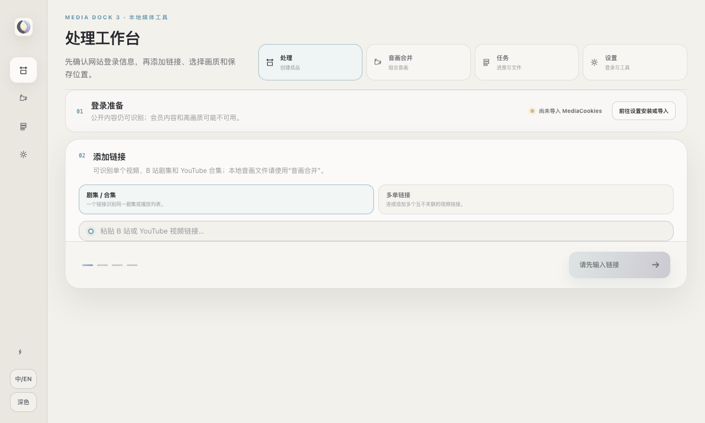
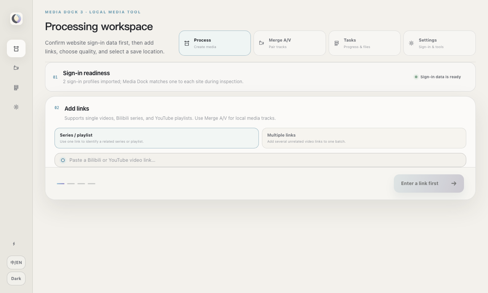
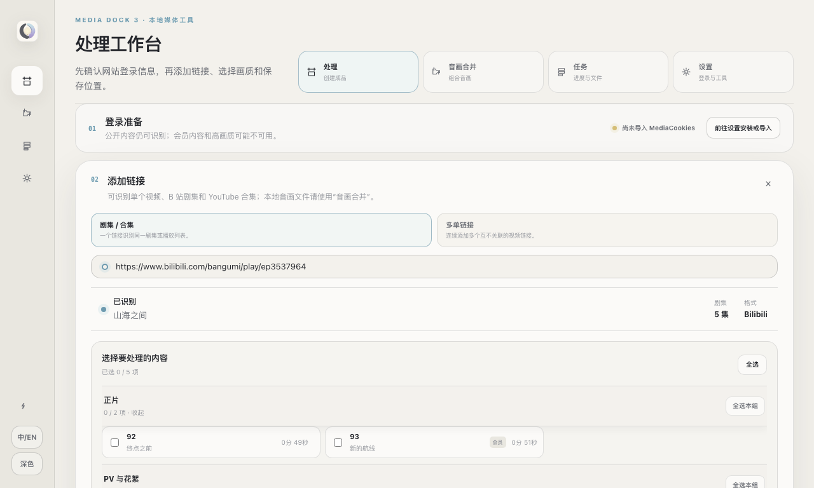
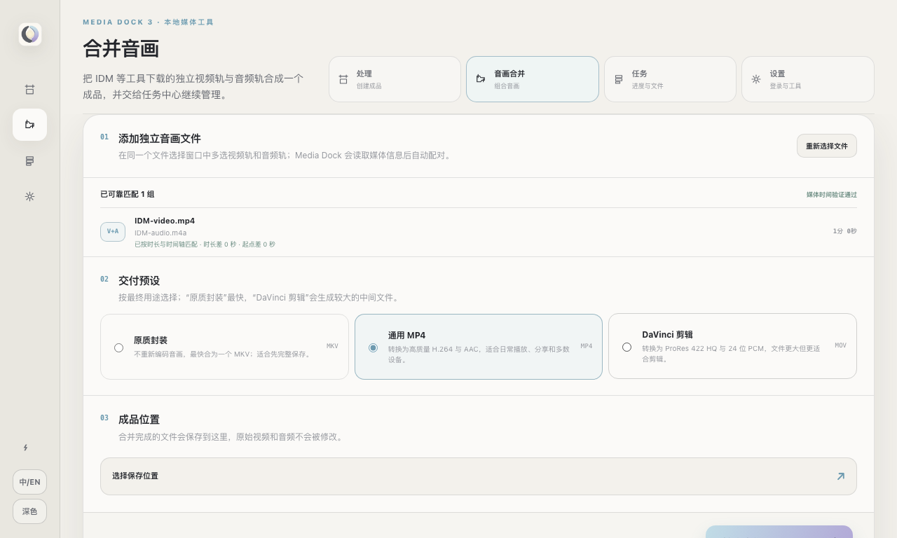
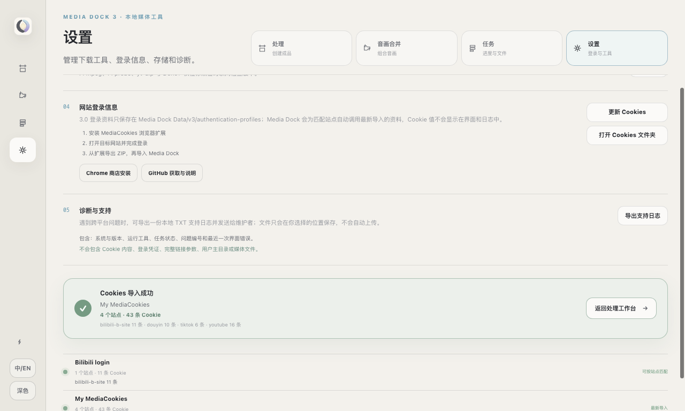
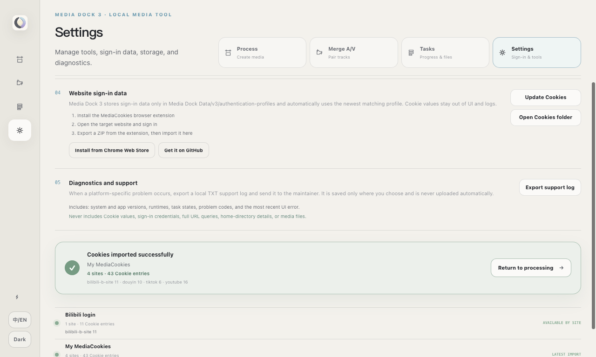

<p align="center">
  
</p>

<h1 align="center">Media Dock · 泊</h1>

<p align="center"><strong>泊其所获，交其所成。</strong></p>
<p align="center">Dock what is gathered, deliver what is made.</p>
<p align="center"><sub>A QIDU Utility</sub></p>

<p align="center">
  <a href="https://github.com/Yifo98/Media-Dock/releases/latest"></a>
  <a href="https://github.com/Yifo98/Media-Dock/releases/tag/v3.0.0"></a>
  
  
</p>

Media Dock · 泊是器度 QIDU 旗下的本地优先媒体获取、音画合并与交付工作台。它把公开链接、B 站剧集、YouTube 合集、登录画质检测、批量任务、独立音画合并和问题诊断收进一个可恢复的桌面流程。应用在本机使用 `yt-dlp`、FFmpeg、Deno 与 MediaCookies；Cookie 值不会进入界面、任务数据库或导出的支持日志。

## 版本状态

| 版本线 | 状态 | 适合谁 |
| --- | --- | --- |
| 3.0.0 | 正式源码版本 | 使用全新工作台、任务模型与 3.0 数据边界的用户 |
| [2.1.2](https://github.com/Yifo98/Media-Dock/releases/tag/v2.1.2) | 旧版维护线 | 需要旧界面和旧数据布局的用户 |

Media Dock 3 使用独立的 `Media Dock Data/v3/` 数据边界，不会改写 2.1.2 数据。当前公开便携包尚未接入商业代码签名，仍会明确标记为未签名预览；Windows Smart App Control 或 macOS Gatekeeper 可能在应用启动前拦截它。

## Media Dock 3 一览

| 中文工作台 | English workspace |
| --- | --- |
|  |  |
| 剧集自动分组 | 音画合并 |
|  |  |
| Cookie 导入结果 | Cookie import result |
|  |  |

更多截图：[任务中心](docs/showcase/3.0.0/04-tasks-zh.png)。原始展示图均来自真实 Electron 界面，尺寸为 1280×768 PNG、无透明层。

观看 [16 秒双语功能演示](docs/showcase/3.0.0/Media-Dock-3.0.0-demo.mp4)，或在 Release 中下载完整媒体素材包。

## 主要能力

- **先识别，再创建任务**：在下载前解析来源、集合结构、登录状态和可用画质。
- **剧集与多单链接**：剧集、PV、花絮和音乐自动分组；也可批量添加互不相关的单条链接。
- **MediaCookies 本地交接**：导入浏览器扩展生成的 ZIP，用于检测会员或登录画质，不展示 Cookie 内容。
- **画质与大小预估**：在创建任务前显示当前登录状态可用的画质上限和估算体积。
- **1 / 2 / 3 并发**：以稳妥、推荐、快速三种调度档位运行独立任务。
- **音画合并**：一次多选音频与视频，按媒体流、时长和时间轴配对，不依赖相似文件名。
- **任务中心**：显示获取、处理、交付进度，完成后可直接打开所在位置。
- **安全清理**：清理任务历史和临时缓存不会删除已经交付到保存位置的媒体。
- **诊断与支持**：导出经过脱敏的 TXT，保留系统、运行工具和问题证据，但排除 Cookie、凭证、完整链接参数、用户目录和媒体路径。

## 下载与运行

前往 [GitHub Releases](https://github.com/Yifo98/Media-Dock/releases)：

- 下载 **3.0.0** 对应平台资产并完整解压。
- Windows 只保留一个入口：`Media Dock.exe`。
- macOS 只保留一个入口：`Launch Media Dock.command`；应用运行组件收纳在 `core/Media Dock.app`。

标准分享包由 `electron-builder` 生成，并在启动入口同级的 `Media Dock Data/` 保存任务数据、工具和缓存。带 `Unsigned` 标记的资产只供可接受系统安全提示的测试者；它不是已经取得平台信任的签名包。

## MediaCookies

需要登录态或会员画质时：

1. 从 [Chrome Web Store](https://chromewebstore.google.com/detail/xf-mediacookies/pkpnjlcfhkgiapclmidlhfgjklhifcek) 或 [GitHub](https://github.com/Yifo98/MediaCookies) 安装 MediaCookies。
2. 在目标网站完成登录。
3. 从扩展导出本地 ZIP。
4. 在 Media Dock 的“设置 → 网站登录信息”中导入或更新。

3.0 只把登录资料保存到 `Media Dock Data/v3/authentication-profiles/`。导入成功后会显示识别到的站点数与 Cookie 条目总数，但不会显示 Cookie 名称和值；需要检查本地副本时可在设置中点击“打开 Cookies 文件夹”。

MediaCookies 不读取密码，也不会把 Cookie 上传到网络。

## 本地开发

要求：Node.js 24、npm，以及项目支持的 Electron 环境。

```bash
npm install
npm run launch:mac:v3
```

项目外层的 `Launch Media Dock 3 Preview.command` 是 macOS 本地预览入口；它调用仓库内的 `scripts/launch-mac-v3-preview.sh`，并使用隔离的 v3 数据目录。仓库同时保留 `scripts/Launch Media Dock 3 Preview.command` 作为不含本机路径的迁移副本。

## 验证

```bash
npm test
npm run lint
git diff --check
```

发布候选还必须完成 [Media Dock 3 release gates](docs/release/3.0-release-gates.md)，特别是实际 Windows/macOS 打包资产、中文与空格路径、目录操作、MediaCookies 导入、运行时更新与诊断导出。

## OpenAI Build Week

参赛要求、时间、提交物、资格限制和 Media Dock 准备清单见 [OpenAI Build Week 参赛要求](docs/hackathon/openai-hackathon-requirements.md)。既有项目只评审提交期内的实质扩展；正式提交还需要 Codex `/feedback` Session ID、GPT-5.6 的真实产品集成、三分钟以内公开演示和可直接测试的构建。

## 文档

- [3.0 product brief](docs/design/3.0-product-brief.md)
- [Implementation sequence](docs/implementation/3.0-sequence.md)
- [Release guide](docs/RELEASES.md)
- [Architecture decisions](docs/adr/)

---

## English

Media Dock · 泊 is a QIDU local-first desktop workspace for acquiring public media, resolving authenticated quality, grouping collections, merging separate audio/video tracks, tracking deliverables, and exporting privacy-safe diagnostics.

**Dock what is gathered, deliver what is made.** · A QIDU Utility

### Release channels

| Channel | Status | Audience |
| --- | --- | --- |
| 3.0.0 | Stable source release | Users adopting the new workspace, task model, and isolated 3.0 data boundary |
| [2.1.2](https://github.com/Yifo98/Media-Dock/releases/tag/v2.1.2) | Legacy maintenance line | Users who still need the previous UI and data layout |

Media Dock 3 owns the isolated `Media Dock Data/v3/` namespace and never rewrites 2.1.2 data. Current portable binaries are still explicitly labeled unsigned previews because the repository has no platform signing credentials; Smart App Control or Gatekeeper may block them before launch.

Watch the [16-second bilingual feature demo](docs/showcase/3.0.0/Media-Dock-3.0.0-demo.mp4), or download the complete media pack from the Release.

### Highlights

- Inspect sources, authentication state, collection structure, available quality, and estimated size before creating work.
- Group main episodes, previews, extras, and music with independent selection controls.
- Batch unrelated links or schedule collection entries with bounded 1 / 2 / 3 task concurrency.
- Import a local MediaCookies ZIP without exposing Cookie values to the renderer, task database, or support log.
- Pair separate video and audio by stream type, duration, and timeline rather than filename similarity.
- Track acquisition, processing, delivery, authentication use, and the selected quality ceiling per task.
- Clear terminal history and managed staging without deleting delivered media.
- Export a user-reviewed support TXT that removes credentials, Cookie values, URL queries, home-directory details, task titles, and media paths.

### Install

Download the 3.0.0 asset for your platform from [GitHub Releases](https://github.com/Yifo98/Media-Dock/releases) and extract the complete ZIP.

- Windows: run the single root entry, `Media Dock.exe`.
- macOS: run the single root entry, `Launch Media Dock.command`; the internal app runtime remains under `core/Media Dock.app`.

Packages are produced by `electron-builder`; portable data stays in the sibling `Media Dock Data/` directory. Assets labeled `Unsigned` are controlled-test artifacts only. Smart App Control or Gatekeeper may block them before launch, so they are not general-public releases.

### Development and checks

```bash
npm install
npm run launch:mac:v3
npm test
npm run lint
```

See the [3.0 release gates](docs/release/3.0-release-gates.md), [release guide](docs/RELEASES.md), and [OpenAI Build Week checklist](docs/hackathon/openai-hackathon-requirements.md) for the full verification and submission boundaries.
